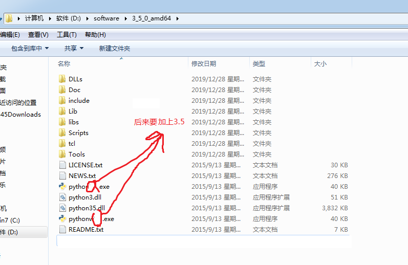

[toc]


# 从买了机器开始


以下安装包都有下载连接，同时在移动硬盘中都有。不就还将其上传到百度网盘中。

#  安装C++编译器(gcc,mingw)

## c++编译器在windows(MinGW)的安装

### 一、什么是 MinGW ？

MinGW 的全称是：Minimalist GNU on Windows 。它实际上是将经典的开源 C语言 编译器 GCC 移植到了 Windows 平台下，并且包含了 Win32API 和 MSYS，因此可以将源代码编译生成 Windows 下的可执行程序，又能如同在 Linux 平台下时，使用一些 Windows 不具备的开发工具。

一句话来概括：MinGW 就是 GCC 的 Windows 版本 。

 

### 二、为什么使用 MinGW ？

1. MinGW 是开源软件，可以免费使用。
2. MinGW 由一个活跃的开源社区在持续维护，因此不会过时。
3. MinGW 支持最新的 C语言 标准。
4. MinGW 使用 Windows 的C语言运行库，因此编译出的程序不需要第三方 DLL ，可以直接在 Windows 下运行。
5. 那些著名的开源 IDE 实际只是将 MinGW 封装了起来，使它拥有友好的图形化界面，简化了操作，但内部核心仍然是 MinGW。
   

MinGW 是稳定可靠的、持续更新的 C/C++ 编译器，使用它可以免去很多麻烦，不用担心跟不上时代，也不用担心编译器本身有严重漏洞，可以放心的去编写程序。

 

### 三、MinGW 适合做什么？


对于熟悉 MinGW 的高手而言，它可以编译任何 C语言 程序。但对于一般人来说，MinGW 太过简陋，连图形用户界面都没有。对于习惯使用鼠标的人来说，是很痛苦的。虽然也可以通过一些配置，让 MinGW 拥有图形用户界面，但那个过程非常麻烦。

除此之外，编译复杂的程序时，还需要你会编写 Makefile ，否则只能一个文件一个文件的编译，可想而知会多么辛苦。

但对于初学 C语言 的人来说，MinGW 是正合适的编译器，至少黑色的命令提示符界面很有编程的气氛，感觉很酷。在刚开始学 C语言 时，一般情况下所有代码都写在一个文件中，只要输入几个简单的命令，就能用 MinGW 编译成可执行文件。虽然  VS2013 等编译器，只要点击下鼠标就可以完成编译，但它会自动生成一大堆工程文件，让初学者摸不着头脑。而 MinGW 则只会生成一个可执行文件。

如果对 MinGW 和 VS2013 等编译器进行一下形容，那么 MinGW 是手动的，而  VS2013 等编译器则是自动的。因此 MinGW 的编译过程更加直观容易理解，也比较适合C语言学习。

总而言之，对于一般人来说，MinGW 适合学习 C语言 时使用，真正工作还是用  VS2013 更好。当然如果您是在 Linux 下工作，那么Code::Blocks可能是一个选择，不过最大的可能是您必须习惯使用 GCC 来编译程序。


### 下载


方法1： 进入官网http://www.mingw.org/ 后，点击右上角的“Downloads”；进入第三个页面后，点击“mingw-get-setup.exe”左边windows图标按钮，稍等6秒左右自动弹出下载对话框，然后保存即可；

方法2：百度网盘 https://pan.baidu.com/s/1PnRgkJvDgbBF0kl91ljhQg


### 安装

1. 点击下载好的mingw可执行.exe文件，如“mingw-get-setup.exe”,点击install；
2. 更改一下下载路径，再点击“Continue”
3. 选择你需要的安装包，点击旁边的方框，然后点击 选择“Mark for installation”。我选的2个分别为：mingw32-gcc-g++-bin，mingw32-base-bin
4. 然后选择左上角installation栏目中的Apply Changes，然后会弹出一个对话框，点击Apply即可，稍等30分钟及以上，等待下载安装完即可，
5. 退出MinGW,在你安装的目录D:/MINGW中的./bin目录下可以看到你安装的可执行文件。
6. 将D:mingw/bin加入到电脑的系统变量的path路径下面。
7. 在cmd中输入 g++ -v, 即可检测是否安装成功。


# 安装 vs code


# 安装vs


# 安装git


git 使用上面的镜像 https://npm.taobao.org/mirrors/git-for-windows/ 选一个即可。安装的过程只需要安装Bush,不用安装GUI

1. 下载

安装完成后，连接 github。方法见github内容。

#  安装python解释器

国内镜像速度非常的快。https://npm.taobao.org/mirrors/python/

在安装过程中，发现有的高级版本的python安装包，双击却没有反应，低级的却可以安装。
说明，有的python安装包的版本需要和系统匹配。
这里使用的是windows7 64 bit系统，amd速龙二X4 730 64bit。所以选择的时候，应该选 xxx-amd64--的python安装包。

可以选择 .msi 或者 .exe 来下载。一般的, .zip 都把所有的东西都写成了.dll，都是把所有东西都打包封闭好了，不能再加东西。
.msi就是microsoft installer的简写，是微软格式的安装包。一般是程序的安装软件。
注意，有的.exe是安装包程序，有的.exe是python使用程序。不过，你在网页上选择的.exe都是安装文件，而.zip中则是执行文件。

这里我最终选的是python-3.5.0-amd64.exe 。
而前面一开始选的3.6.0版本双击没有反应，不能安装。而3.0.0版本双击可以安装，但是安装后的文件中缺有pip.exe,pip3.exe,east_install.exe，这就没办法让我以后装其他的python扩展包了。所以3.0.0也不用。

最终选的是3.5.0 


下载来之后，双击，安装到d:盘，文件内的内容是

这里,所有版本安装后，一开始可执行文件都是python.exe, （而不是python3.5.exe）,为了以后当要增加其他版本的python，便于互相可以区分，这里最好把可执行文件名修改一下最好（这里改为python3.5.exe）。

同时 ./Scripts 文件夹中包含的是pip.exe, pip3.exe, easy_install.exe . 方便以后增加扩展包。（但是3.0.0版本就没有）

要想可以在cmd中直接使用python命令，那么就将它加入到电脑的系统变量中。
（注意：电脑中有一个东西叫做 环境变量，而环境变量又包括 系统变量和用户变量，二者都有自己的path路径。如果在系统变量中修改path路径，那么所有的用户都可以受到影响，而如果在用户变量中修改path路径，那么只有这一个用户会受到影响。）

右键《我的电脑》 --》 属性  --> 高级系统设置 --》 高级 --》环境变量  --》在系统变量（不要是用户变量）下面找到path。
然后在path中 加入python可执行文件python3.5.exe 所在文件夹的路径（即加入的是D:\software\3_5_0_amd64, 而不是D:\software\3_5_0_amd64\python3.5.exe ）

这是，你发现cmd中可以直接输入 python3.5 , 就可以直接使用在命令行中使用python了。

#  安装 pip

为了以后方便使用pip, 把pip所在的文件夹路径也加入到path路径中(如上面一样)。即 ;D:\software\3_5_0_amd64;D:\software\3_5_0_amd64\Scripts

这是，你发现cmd中可以直接输入 python3.5 , 就可以直接使用在命令行中使用python了。

但是，你会发现 如果输入 pip(或者pip3),会报错为 Fatal error in launcher: Unable to create process using '"' 

方法就是更新 pip和pip3.

`pip3 install --upgrade pip -i http://mirrors.aliyun.com/pypi/simple/ --trusted-host mirrors.aliyun.com`

这里从 -i开始，是为了使用阿里的镜像，以后使用pip3下载安装包的使用都这样，可以加快几十倍

`-i http://mirrors.aliyun.com/pypi/simple/ --trusted-host mirrors.aliyun.com`

如果不行，出现但是我输入后显示Requirement already up-to-date: pip in c:\python35\lib\site-packages，，则要强制更新

`python3 -m pip install --upgrade pip --force-reinstall -i http://mirrors.aliyun.com/pypi/simple/ --trusted-host mirrors.aliyun.com`

这样，pip的问题就解决玩了，可以使用pip下载其他包了

#  安装 virtualenv

`pip3 install virtualenv -i http://mirrors.aliyun.com/pypi/simple/ --trusted-host mirrors.aliyun.com`

这就可以构建虚拟环境了。
你会发现，安装virtualenv后，最后的virtalenv.exe是安装在./Scripts文件夹中的。

下面讲解virtualenv在windows中命令行中的使用
https://blog.csdn.net/qq_41621362/article/details/94793693

1. 创建一个名为env的虚拟环境
   virtualenv env
2. 激活env虚拟环境

```
cd env
cd Scripts
activate
```


# 安装 jupyter： 

` pip3 install jupyter`

使用jupyter: >>>jupyter notebook
但是会报错，为 \tornado\util.py  from typing import ImportError: cannot import name 'Type'
原因是tornado与版本不符合，将tornado降为低版本即可。 
`pip3 uninstall tornado`
`pip3 install tornado==5.1.1 -i http://mirrors.aliyun.com/pypi/simple/ --trusted-host mirrors.aliyun.com`


# 安装python编辑器(即 pycharm)

注意，pycharm仅仅是一个编辑器，相当于一个躯壳，所以仅仅安装了pycharm是不能使用python的。

要想使用pycharm，还需要安装python解释器pythom.exe, 再安装一个virtualenv的python扩展包 来创建虚拟环境。


#  安装虚拟机vamware

激活秘钥

```
YG5H2-ANZ0H-M8ERY-TXZZZ-YKRV8
UG5J2-0ME12-M89WY-NPWXX-WQH88
UA5DR-2ZD4H-089FY-6YQ5T-YPRX6
```

1. 下载vmware 15.5.0

    http://www.downza.cn/soft/74728.html 

2. 安装

   正常情况下，双击即可。

   但是，这里双击 报错  **“安装程序无法继续,出现Microsoft Runtime DLL 安装程序未能完成安装。”** 

   解决办法  https://www.cnblogs.com/wxdblog/p/7091496.html  是

   ```
   　1.出现这个问题的时候不要点 错误框的 确定（如果点了确定，会找不到步骤4中的文件夹）
   　2.win+R调出 '运行'
   　3.输入%temp%，进入C:\Users\ADMINI~1\AppData\Local\Temp
   　4.找到类似文件夹{537B7F85-2B95-44ED-8D90-765F6F36D666}~setup，以~setup结尾
   　5.进入该文件夹，运行里面的程序安装即可。我当时有三个可执行文件，最终点击 vmwareWorkstation.msi 就可以正常安装了。
   ```

   

3. 下载 ubuntu18.04镜像

    http://releases.ubuntu.com/  滑到最下面，找到  /18.04/ , 点击，进入了  http://releases.ubuntu.com/18.04/ 

   然后下载 ubuntu-18.04.3-desktop-amd64.iso 。

   注意，下载的是镜像，所以应该下载.iso文件，由于要下载ubuntu桌面版，所以应该是 ubuntu，desktop; 又由于下载64位系统，所以是 amd64.

   当你看到 ubuntu-18.04.3-live-server-amd64.iso 时，live-server表示下载的是服务器版，纯命令行。

   

4. 安装ubuntu

   打开vmware, 将  ubuntu-18.04.3-desktop-amd64.iso加入到 CD/DVD 2 即可了。剩下的都可很简单。

   期间，在安装 ubuntu中，在一个地方 停了好久，大概1个小时，还显示出 **"started network manager script dispatcher service"**。

   我的问题解决方法是： 先在控制面板--》 网络与连接 --》 更改适配器设置 中，看看 vmware 网络是否被自己禁止了。如果没有，直接把台式机的无线网卡 拔了，然后它就自己好了。等它安装好后，把无线网卡插上去就可以了。

   

5. 下载vmware tools  （保证虚拟机可以全屏显示）

   http://softwareupdate.vmware.com/cds/vmw-desktop/ws/  找到15.5.0版本。我是在win7 下 使用 vmware, 在 vmware 下 使用 ubuntu 。所以步骤为 windows -----> packages -----> tools-linux.tar

   安装很简单。

   将tools-linux.tar解压，发现有tools-linux.iso镜像。然后 开启 vmware,并一定要打一个ubuntu操作系统，然后选中这个操作系统，在 虚拟机 -----》 设置 -----》 CD/DVD 中 添加 这个tools-linux.iso进去即可。一般里面有两个 CD/DVD, 其中 一个存放的是ubuntu.iso镜像。这个就不要动他。将tools-linux.iso 添加到 另一个CD/DVD即可。然后 将ubuntu系统关机，然后再打开。

   你会在桌面上看到 两个 CD/DVD文件（可能两个叠加在一起，这个不好发现，自己去移动一下），进入tools-linux.iso， 看到 有run_upgrader.sh, 则`sudo ./run_upgrader.sh`  ，然后确定 --》 确定 ，则安装了 vmware-tools.

   然后 查看--》 自动调整大小--》选中 居中显示客户端 和 自动适应窗口。

   然后 查看 --》 全屏。 

   则完成任务，ubuntu系统可以全屏了。

#  安装markdown编辑器(即 Typora)

 https://pc.qq.com/detail/1/detail_24041.html 


#  安装 速盘(百度网盘不限速)


#  安装chrome, notepad++

